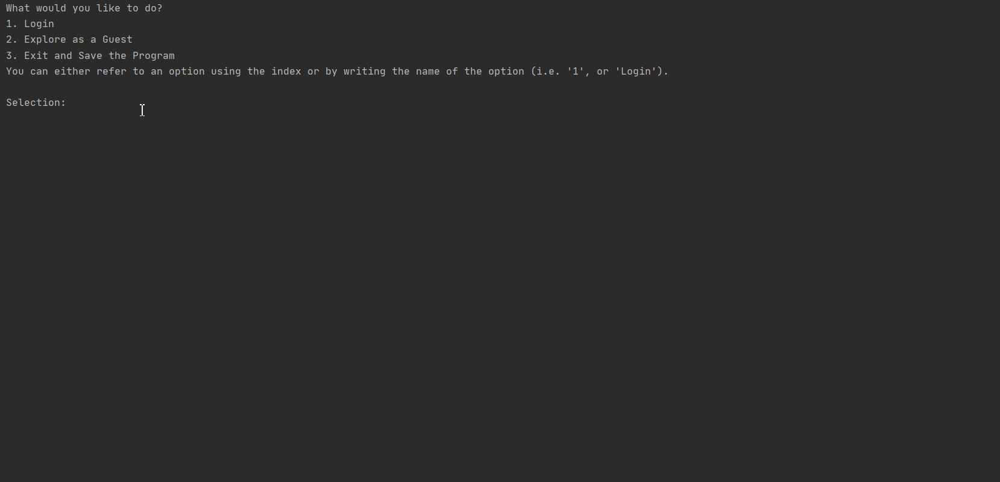

# EventManagementSystem

EventManagementSystem is an application that manages the logistics of a conference and allows different stakeholders to carry out their respective role.
EventManagementSystem is designed and developed by following clean architecture and object-oriented programming principles. It is a collaboration of 8 University of Toronto students as part of a school project for course CSC207H1 (Software Design) in the Fall of 2020.

## Demo 

Logging in as an organizer and creating an event called "Java 101" for the conference.



## User Types
This application has defined 5 different user types that each have different functionality. 

Attendee: Attendee is the basic user type in our program. They represent the group of people who will be attending the events. Attendees are able to access messenger functions, view events and register/cancel an event, make requests to organizers and have a friend list. 

Organizer: Organizers are the group of users who are hosting the conference. Organizer inherits all the functions from Attendee. Additionally, Organizer can manage events (create, modify, delete etc.), manage users (create user accounts), manage user requests and view summary data of conferences. 

Speaker: Speaker is a user that can delivery a talk/speech to events. Speaker inherits all the functions from Attendee. Additionally, Speaker can view the events he gives as well as view the list of attendees of the events they will be speaking in and send message to them.

Guest: Guests can view events, including viewing events by speakers and days but no other actions are provided. Unlike all user types, guest does not have an account.

VIP: Vips are a special kind of attendee where they have access to all the actions that any other attendees can take, but also with extra features. Features including having they own personal wishlist for events, have their own favorite speakers list and create/host 
a party (a special type of event that has no speaker).

## Functionality
Below are explanation of some of the major functions of EventManagementSystem. There are however, more functions that have been developed but not explicitly explained below.

### Event
Event represents a talk that will be held in the conference. It can be created, modified or cancelled by an organizer. Each room has an associated Room, capacity, speaker(s), event date and time, and duration of event.

- Room: The room or location of the event.
- Capacity: Maximum number of users that can attend.
- Speaker: The users who will be speaking in the event. There could be no speaker for an event (party).
- Event date and time: Date and time of the event.
- Event duration: How long the event will last.

### Room
Room is the place where every event is held. It can be created or modified by an organizer. Each room has its unique ID, name, capacity, opening hours, the schedule, list of features.

- Opening hours: Rooms also have its own opening and closing time and all events must start and end during this period.
- Schedule: The booking schedule for the room.
- List of features: Features that the room has to accommodate the event. e.g. Project, white board.

### Messaging System
EventManagementSystem has an extensive messaging system that allow users in the application to communicate with each other.

Attendees can only send direct message to other users who are on their friend's list. They are allowed to simultaneously send the same message to more than 1 users in their friend's list. 

Organizers can send message to all attendees and speakers can send message to all attendees of event(s) they will speaking in. 

All users will get an inbox of messages that they received, it can also be grouped by who sent the message (message sent from Organizer, Speaker or Attendee). Users can also mark messages in the inbox as unread, delete, or archive messages after reading them.


## Getting Started
This repository simply provides the framework of the web application and some code will need to be changed to accommodate each healthcare institution. 

### Clone this project

```bash
  git clone https://github.com/calvinhychu/Database-for-Medication-Safety-in-Geriatric.git
```

### Demo Data
Test.java in EventManagementSystem/src/main provided some sample test data to demo the program. Please change or delete accordingly.

Here are some of the demo data that the team has developed for trial purposes:

Demo Organizer account: - Email: organizer1@conference.com / Password: organizer1

Demo Speaker account: - Email: speaker1@conference.com / Password: speaker1

Demo Attendee account - Email: attendee1@conference.com / Password: attendee1

Demo VIP account - Email: vip1@conference.com / Password: vip1

Note: Every demo accounts are friends with all other demo accounts. This enables messaging for accounts.

## Usage

1. Run App.java at EventManagementSystem/src/main
2. Login to program
3. Choose any of the features provided
4. Make sure to use the "Exit and Save the Program" option when closing the program to preserve and save the data


## Disclaimer
EventManagementSystem is designed and developed by 8 University of Toronto students as part of a school project for course CSC207H1 (Software Design) in the Fall of 2020. It's publication to GitHub has been approved by the CSC207H1 course team.